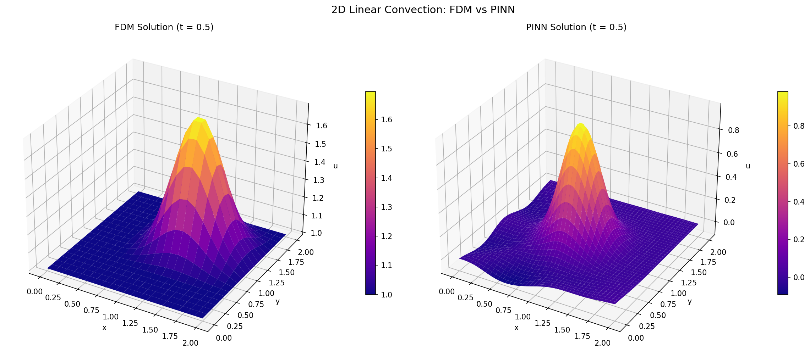

# 2D Linear Convection Simulation (Fortran + PINN)

Two independent solvers for the **2D Linear Convection Equation**: a Fortran finite-difference method (FDM), and a PyTorch Physics-Informed Neural Network (PINN) that learns the same PDE.

## 1. Overview
The program simulates the transport of a scalar quantity $u$ (such as temperature or concentration) as it is moved by a constant velocity field $(c, c)$ in a two-dimensional space.

### Mathematical Foundation
The code solves the first-order wave equation:
$$\frac{\partial u}{\partial t} + c \frac{\partial u}{\partial x} + c \frac{\partial u}{\partial y} = 0$$

## 2. Program Structure

### Grid and Domain
- **Spatial Resolution:** A $21 \times 21$ grid (`nx`, `ny`).
- **Domain Size:** The physical space ranges from 0.0 to 2.0 in both $x$ and $y$ dimensions.
- **Grid Spacing ($dx, dy$):** Calculated as $2.0 / (21 - 1) = 0.1$.

### Discretization Scheme
The program utilizes the **First-Order Upwind Scheme** (Backward Difference). This is a stable numerical method where the spatial derivative at a point depends on the direction of the flow (the "upwind" side).

The discretized update formula used in the code is:
$$u_{i,j}^{n+1} = u_{i,j}^n - c \frac{\Delta t}{\Delta x}(u_{i,j}^n - u_{i-1,j}^n) - c \frac{\Delta t}{\Delta y}(u_{i,j}^n - u_{i,j-1}^n)$$

### Initial Conditions
- **Background:** The entire field is initialized to $1.0$.
- **Top-Hat Pulse:** A square region between $0.5$ and $1.0$ in both $x$ and $y$ is set to $2.0$. This creates a "cube" shape in the data which will be convected (moved) across the grid over time.

## 3. Computational Logic

1.  **Variable Declaration:** Defines grid parameters, time steps, and two-dimensional arrays (`U` for current state, `UN` for the previous state).
2.  **Initialization:** Sets the grid spacing and the initial top-hat pulse.
3.  **Time-Stepping Loop:** - The outer loop iterates through 50 time steps (`nt`).
    - `UN` captures the state of the grid before the update.
    - Nested loops update the interior points ($i=2$ to $nx-1$) using the convection formula.
4.  **File Output:** Writes the final $21 \times 21$ matrix to `resu.txt` with formatted columns for easy visualization or post-processing.

## 4. Technical Constraints
- **CFL Condition:** The stability of this simulation depends on the Courant-Friedrichs-Lewy (CFL) condition. With $c=1$, $dt=0.01$, and $dx=0.1$, the Courant number is $0.1$, which is well within the stability limit ($C \le 1$).
- **Boundary Conditions:** The code implicitly keeps the boundaries at their initial values (Dirichlet conditions), as the loops skip the first and last rows/columns.

---

## 5. Physics-Informed Neural Network (PINN) Approach

As a mesh-free alternative to the finite-difference solver above, `2-D_Linear_convection/PINN_PDE.ipynb` trains a neural network to satisfy the same governing PDE directly, without discretizing the domain into a grid or marching forward in time.

### Network Architecture
- A fully connected `PINN` network with inputs $(x, y, t)$ and a single output $u(x, y, t)$.
- Layer sizes: $[3, 64, 64, 64, 1]$ with `tanh` activations, implemented in PyTorch.
- Trained with the Adam optimizer (`lr = 1e-3`) for 2000 epochs.

### Physics-Informed Loss
Rather than learning from labeled simulation data, the network is constrained by the PDE residual itself, computed via automatic differentiation:
$$f := \frac{\partial u}{\partial t} + c_x \frac{\partial u}{\partial x} + c_y \frac{\partial u}{\partial y}$$

The total loss combines two terms:
- **Initial-condition loss:** MSE between the network's prediction and the prescribed $u(x, y, 0)$ at 1,000 randomly sampled points.
- **PDE residual loss:** MSE of $f$ evaluated at 10,000 collocation points sampled across the domain $x, y \in [0, 2]$, $t \in [0, 0.5]$, driving the residual toward zero everywhere (not just at the sampled points).

### Initial Condition
The PINN was trained on a smooth Gaussian pulse centered at $(0.5, 0.5)$:
$$u(x, y, 0) = \exp\left(-\frac{(x-0.5)^2 + (y-0.5)^2}{0.1}\right)$$
This differs from the Fortran solver's top-hat pulse (Section 2), so the two solutions shown side-by-side above are not a pointwise comparison of the same run — they instead illustrate the same convection physics ($c_x = c_y = 1.0$) solved by two fundamentally different methods. The PINN was additionally validated against the **analytical solution** (the same Gaussian, shifted by $c\,t$), achieving a low RMS error at $t = 0.5$, and cross-checked against a matching upwind FDM run on its own Gaussian IC (see the notebook's final cells).

### Output
- Predictions are evaluated on an $80 \times 80$ grid at the snapshot time $t = 0.5$ and exported to `2-D_Linear_convection/pinn_2d_convection_results.csv` (`x, y, t, u_pinn`).
- `2-D_Linear_convection/fdm_vs_pinn_3d.png` renders the Fortran FDM surface and the PINN surface side by side in 3D for visual comparison.
