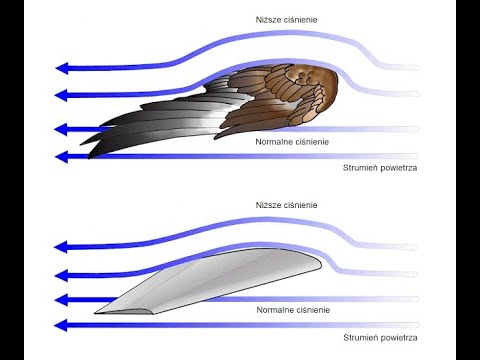

# Numerical Investigation of Porous Aerofoils

This repository contains the numerical study and analysis of bioinspired porous aerofoils for UAV and drone applications.

---

## 📊 Key Results

### Aerofoil Geometry
The study uses a NACA 0012 aerofoil with an internal porous medium governed by Darcy's law.

### Aerodynamic Coefficients 

Comparision of Coefficient of Lift at reynolds number 2000, 20000, 200000. 

Reynolds Number Sensitivity

### Pressure Distribution

Pressure Contour

---

## Methodology

